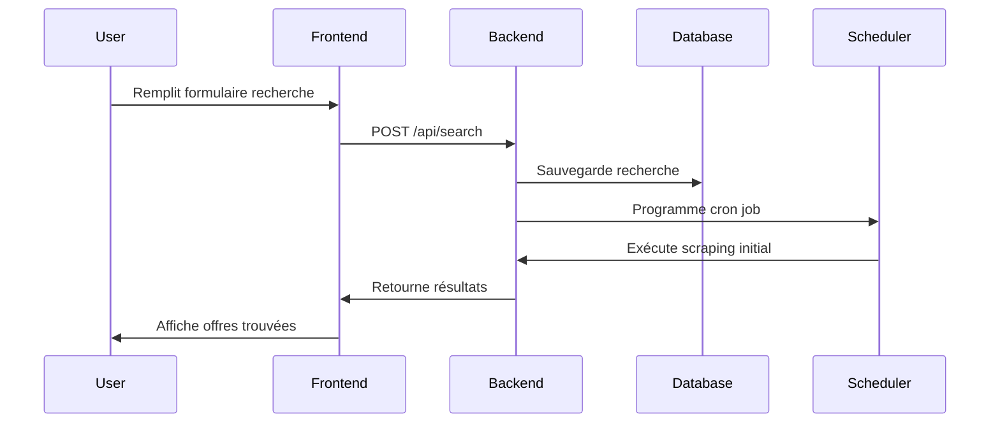
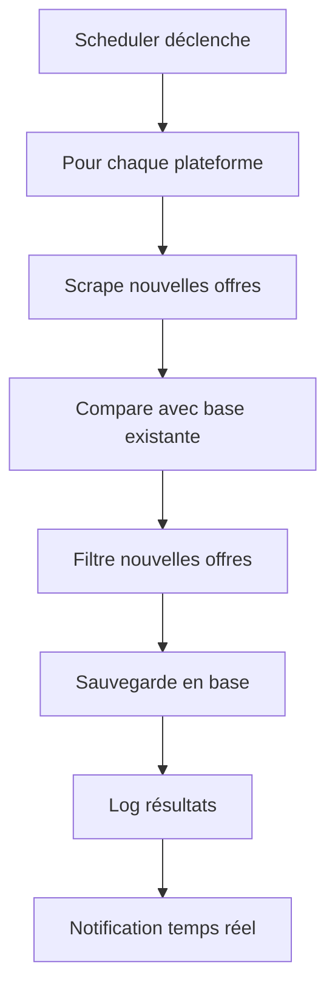

# Contexte Technique - JobHub

## 🎯 Objectif du Projet

JobHub résout un problème critique dans la recherche d'emploi : **l'arrivée tardive sur les offres**. Quand une offre intéressante est publiée, elle reçoit généralement 50+ candidatures en quelques heures. JobHub automatise la veille pour permettre aux utilisateurs d'être parmi les premiers candidats.

### Problème identifié
- Les offres d'alternance/stage en Data Science/IA sont très compétitives
- Les meilleures opportunités disparaissent en quelques heures
- La veille manuelle est chronophage et inefficace
- Pas d'outil existant pour une veille automatisée multi-plateformes

### Solution proposée
Une application web qui scrape continuellement les plateformes de recrutement et notifie immédiatement des nouvelles offres correspondant aux critères utilisateur.

## 🏗️ Implémentation Technique

### Frontend - Interface Utilisateur

#### Technologies choisies
- **React + Vite** : Build rapide et développement moderne
- **JSX sans TypeScript** : Simplicité et rapidité de développement
- **Tailwind CSS v3** : Système de design cohérent et responsive

#### Architecture des composants
```jsx
// Structure modulaire pour maintenabilité
<Layout>
  <Header />
  <main>
    <SearchForm onSubmit={handleSearch} />
    <Dashboard stats={stats} />
    <JobsList jobs={jobs} realTime={true} />
  </main>
  <Footer />
</Layout>
```

#### Design System Spécifique
- **Couleurs principales** : Noir (#0A0A0B), Or (#FFD700), Blanc (#FFFFFF)
- **Éléments graphiques** : Patterns géométriques, glassmorphism
- **Animations** : Micro-interactions pour feedback utilisateur
- **Responsive** : Mobile-first approach avec Tailwind

### Backend - Logique Métier

#### Architecture Flask
```python
# Structure modulaire pour évolutivité
app/
├── models/          # SQLAlchemy models
├── routes/          # API endpoints  
├── services/        # Business logic
├── scrapers/        # Scraping modules
└── utils/          # Helpers & config
```

#### Système de Scraping
```python
class BaseScraper:
    def scrape(self, keywords, job_type, since_date):
        # Méthode abstraite à implémenter
        pass
    
    def parse_job(self, html_element):
        # Extraction des données communes
        return {
            'title': title,
            'company': company,
            'url': url,
            'date_posted': date,
            'location': location
        }

# Implémentations spécifiques
class IndeedScraper(BaseScraper): ...
class LinkedInScraper(BaseScraper): ...
class WelcomeToTheJungleScraper(BaseScraper): ...
```

#### Système de Cron Jobs
- **APScheduler** pour la gestion des tâches programmées
- Exécution toutes les 15 minutes (configurable)
- Gestion des erreurs et retry automatique
- Logs détaillés pour debugging

### Base de Données

#### Modèle de données
```sql
-- Table des recherches utilisateur
CREATE TABLE searches (
    id INTEGER PRIMARY KEY,
    keywords TEXT NOT NULL,
    job_types TEXT NOT NULL,  -- JSON array
    duration_minutes INTEGER DEFAULT 15,
    platforms TEXT NOT NULL, -- JSON array
    is_active BOOLEAN DEFAULT TRUE,
    created_at TIMESTAMP DEFAULT CURRENT_TIMESTAMP
);

-- Table des offres trouvées
CREATE TABLE jobs (
    id INTEGER PRIMARY KEY,
    search_id INTEGER REFERENCES searches(id),
    title TEXT NOT NULL,
    company TEXT,
    url TEXT UNIQUE NOT NULL,
    platform TEXT NOT NULL,
    location TEXT,
    date_posted TIMESTAMP,
    date_found TIMESTAMP DEFAULT CURRENT_TIMESTAMP,
    is_new BOOLEAN DEFAULT TRUE
);

-- Table des logs d'exécution
CREATE TABLE execution_logs (
    id INTEGER PRIMARY KEY,
    search_id INTEGER REFERENCES searches(id),
    platform TEXT NOT NULL,
    jobs_found INTEGER DEFAULT 0,
    execution_time FLOAT,
    status TEXT NOT NULL, -- 'success', 'error', 'partial'
    error_message TEXT,
    executed_at TIMESTAMP DEFAULT CURRENT_TIMESTAMP
);
```

## 🔄 Flux de Données Détaillé

### 1. Création d'une Recherche


### 2. Exécution Automatique


## 🛡️ Gestion des Défis Techniques

### Anti-Bot Protection
- **Rotation des User-Agents** : Simulation de vrais navigateurs
- **Délais aléatoires** : Entre les requêtes pour éviter détection
- **Proxies rotatifs** : Pour les gros volumes (futur)
- **Selenium avec Chrome headless** : Pour les sites JavaScript

### Rate Limiting
```python
from flask_limiter import Limiter

limiter = Limiter(
    app,
    key_func=get_remote_address,
    default_limits=["200 per day", "50 per hour"]
)

@app.route("/api/search")
@limiter.limit("10 per minute")
def create_search(): ...
```

### Gestion des Erreurs
- **Circuit Breaker** : Arrêt temporaire si trop d'erreurs
- **Retry Policy** : 3 tentatives avec backoff exponentiel
- **Fallback Strategies** : Scraping alternatif si plateforme down
- **Health Checks** : Monitoring continu des scrapers

### Performance
- **Caching Redis** : Résultats fréquents (futur)
- **Requêtes asynchrones** : aiohttp pour le scraping parallèle
- **Pagination** : Chargement progressif des résultats
- **Compression** : Gzip sur les réponses API

## 🔐 Sécurité et Éthique

### Respect des Terms of Service
- **Politeness Policy** : 1-2 secondes entre requêtes
- **robots.txt compliance** : Respect des restrictions
- **Pas de données personnelles** : Seulement URLs publiques
- **Rate limiting strict** : Éviter surcharge des serveurs

### Protection des Données
- **Pas de stockage utilisateur** : Application stateless
- **Logs anonymisés** : Pas d'IP tracking
- **HTTPS obligatoire** : Chiffrement des communications
- **Input validation** : Prévention injections

## 📊 Monitoring et Observabilité

### Métriques clés
```python
# Exemple de métriques à tracker
metrics = {
    'jobs_scraped_total': Counter,
    'scraping_duration_seconds': Histogram,
    'scraping_errors_total': Counter,
    'active_searches': Gauge,
    'new_jobs_found': Counter
}
```

### Logs structurés
```json
{
  "timestamp": "2025-08-15T10:30:00Z",
  "level": "INFO",
  "message": "Scraping completed",
  "search_id": 123,
  "platform": "indeed",
  "jobs_found": 5,
  "duration": 2.3,
  "keywords": "data science"
}
```

### Alerting
- Slack/Discord webhooks pour erreurs critiques
- Email digest quotidien des performances
- Dashboard Grafana pour métriques temps réel (futur)

## 🚀 Déploiement et Évolutivité

### Environnements
- **Development** : SQLite + Flask dev server
- **Staging** : PostgreSQL + Gunicorn + Nginx
- **Production** : Docker + PostgreSQL + Redis + Load Balancer

### CI/CD Pipeline
```yaml
# .github/workflows/deploy.yml
on: [push, pull_request]
jobs:
  test:
    - run: pytest backend/tests/
    - run: npm test frontend/
  build:
    - run: docker build -t jobhub .
  deploy:
    if: branch == 'main'
    - run: deploy to production
```

### Monitoring Production
- **Health endpoints** : `/health`, `/ready`
- **Prometheus metrics** : Exposition des métriques
- **Structured logging** : ELK stack (futur)
- **Error tracking** : Sentry integration

Cette architecture technique garantit une application robuste, évolutive et maintenant les meilleures pratiques de développement moderne.
